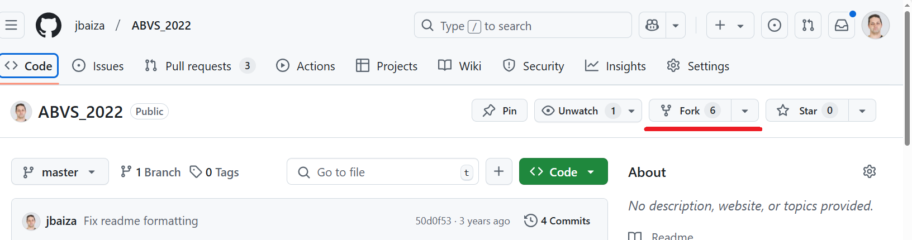
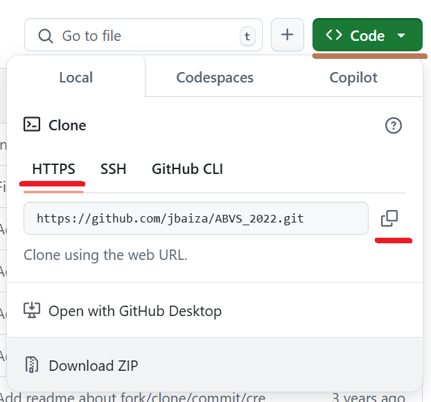
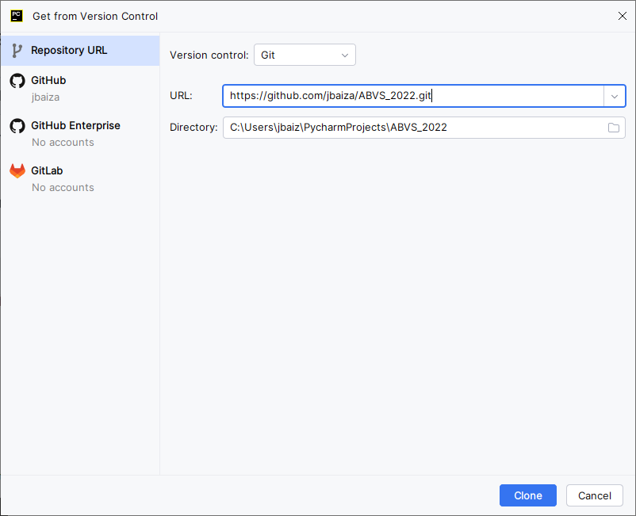
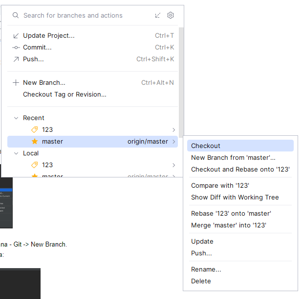
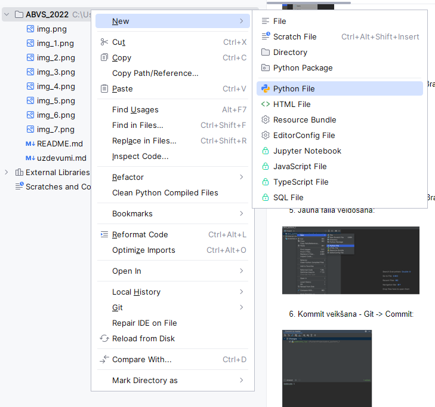
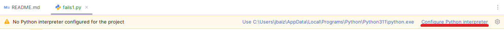
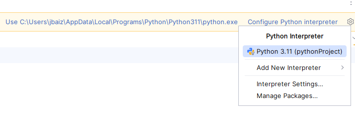
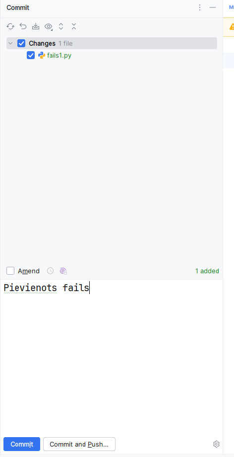

1. Repozitorija kopēšana savā github kontā:

2. Repozitorija klonēšana:

* Nokopējam repozitorija URL:
 

*	Klonējam repozitoriju (File -> Project from Version Control vai Git -> Clone:
 

3. Pārslēgšanās uz master zaru, ja vēl nav (Git -> Branches):
 

4. Jauna zara izveidošana - Git -> New Branch.
5. Jauna faila veidošana (labais taustiņš uz projekta nosaukuma). Dialoga logā izvēlamies "Add":

6. Python izpildes vides pievienošana:

 
7. Kommit veikšana - Git -> Commit:
 

8. Izmaiņu nosūtīšana uz GitHub - Git -> Push.
9. Pull request izveidošana:
 

